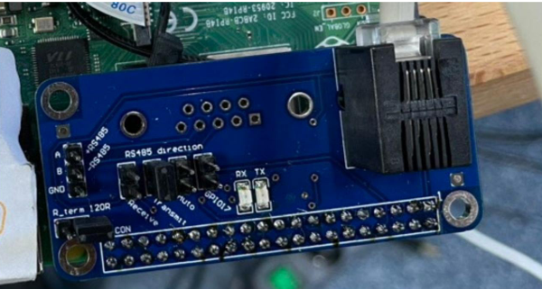

# Flip Dot Display XY5 28x7 raspi python

[日本語版はこちら](https://qiita.com/mokuro916/items/a1196fa752f3434eaa5e)

This project provides Python code to control the Alfa Zeta Flip Dot Display XY5 28x7 using a Raspberry Pi 4B and RASPI HAT. The `frames` directory includes demo frames and the original video file `V.mp4` used to generate these frames. There are three main functionalities included in this directory:

## Table of Contents

- [Demo](#demo)
- [MP4 Conversion](#mp4-conversion)
- [Frame Display](#frame-display)
- [Installation](#installation)
- [DIP Switch Settings](#DIP-Switch-Settings)
- [Sending Data to the Flipdot Display](#sending-data-to-the-flipdot-display)
- [Control Instructions](#control-instructions)

## Demo

The `demo.py` script allows you to display specific patterns on the flip-dot display. It uses a matrix like the one below, consisting of 0s and 1s, to create patterns:

```python
matrix = [
    "0000000000000000000000000000",
    "0000000000100000000000000010",
    "1101100000100000000100010000",
    "1010101110101010101110111010",
    "1010101010110010100100010010",
    "1000101110101011100110011010",
    "0000000000000000000000000000"
]
```

## MP4 Conversion

The `MP4.py` script converts video files into black and white, resizes them to 28x7, and converts them into frames using OpenCV. These frames are saved into a directory called `frames`.

## Frame Display

The `start.py` script reads frames from the `frames` directory and displays them on the flip-dot display at 15 frames per second. You can watch a demonstration of this on YouTube(https://www.youtube.com/watch?v=qY5p3bfn78A&ab_channel=mokuttii).


## Installation

To set up the environment for this project, follow these steps:

1. **Enable Serial Port and Disable Serial Console**:
    1. Open the Raspberry Pi configuration tool:
    ```bash
    sudo raspi-config
    ```
    2. Navigate to `Interfacing Options` and select `Serial`.
    3. When asked "Would you like a login shell to be accessible over serial?", select `No`.
    4. When asked "Would you like the serial port hardware to be enabled?", select `Yes`.
    5. Exit the configuration tool and reboot your Raspberry Pi:
    ```bash
    sudo reboot
    ```

2. **Create and navigate to the `flip` directory**:
    ```bash
    mkdir flip
    cd flip
    ```

3. **Clone the repository into the `flip` directory**:
    ```bash
    git clone https://github.com/mokuttii/Flip-Dot-Display
    cd Flip-Dot-Display
    ```

4. **Create a virtual environment**:
    ```bash
    python3 -m venv env
    ```

5. **Activate the virtual environment**:
    ```bash
    . /env/bin/activate
    ```

6. **Install the required dependencies**:
    ```bash
    pip install opencv-python pyserial
    ```

### Demo

1. **Activate the virtual environment**:
    ```bash
    . /env/bin/activate
    ```

2. **Run the demo script**:
    ```bash
    python3 demo.py
    ```

3. **Run the start.py script**:
    ```bash
    python3 start.py
    ```

## DIP Switch Settings

### DIP Switch Settings


### 3-Pin DIP for Baud Rate

The communication transfer speed can be set as follows. Following the settings in the picture, the speed will be 9600.

```plaintext
DIP Switch Position| Baud Rate
-------------------------------
↓ ↓ ↓              | None
↑ ↓ ↓              | None
↓ ↑ ↓              | None
↑ ↑ ↓              | 9600
↓ ↓ ↑              | 19200
↑ ↓ ↑              | 38400
↓ ↑ ↑              | 57600
↑ ↑ ↑              | 9600
```

### 8-Pin DIP for Address

This address ID is used when pushing image data, and each panel listens to the data.

```plaintext
Pin | Description
------------------------------
1-6 | Address in binary code (natural)
7   | Magnetization Time: OFF: 500μs (default), ON: 450μs
8   | Test Mode: ON/OFF. OFF = Normal Operation
```

## Sending Data to the Flipdot Display

To transmit data to the Flipdot Display, an RS-485 interface is required. This can be achieved using either a USB-to-RS-485 converter or an RS-485 HAT (Hardware Attached on Top) for the Raspberry Pi.

### Example Setup:
The following setup uses an RS-485 HAT for seamless integration:


1. Attach the RS-485 HAT to the Raspberry Pi's GPIO pins.
2. Connect the RS-485 output pins to the Flipdot Display's input terminals.
3. Ensure the DIP switch settings match the communication requirements.
4. Provide a 24V power supply to the display.

This setup enables smooth data transmission from the Raspberry Pi to the Flipdot Display using RS-485 protocol.

## Control Instructions
To operate the Alfa Zeta Flip Dot Display XY5 28x7, send serial commands with a structured byte array:

### Command Structure

The command to control the display is structured as follows:

```python
all_dark = bytearray([
    0x80,  # Header
    0x83,  # 28 bytes, refresh
    0xFF,  # Address
    0x00, 0x00, 0x00, 0x00, 0x00, 0x00, 0x00, # 28 bytes of data
    0x00, 0x00, 0x00, 0x00, 0x00, 0x00, 0x00,
    0x00, 0x00, 0x00, 0x00, 0x00, 0x00, 0x00,
    0x00, 0x00, 0x00, 0x00, 0x00, 0x00, 0x00, 
    0x8F # End of Transmission (EOT)
])
```

- **0x80**: Header byte
- **0x83**: 28 bytes, refresh
- **0xFF**: Address byte
- **0x00 to 0x7F**: 28 bytes of data
- **0x8F**: End of Transmission (EOT)

### Byte Explanation

- **0x00 to 0x7F**: These bytes represent the 28 columns of the 7x28 grid. Each column is represented by a hexadecimal value, with a maximum value of 0x7F (127 in decimal). This value corresponds to the 7 bits of data for that column, with each bit representing the state (on or off) of a dot.

For example, the binary value `1111111` translates to the hexadecimal value `0x7F`, indicating that all seven dots in the column should be on.

