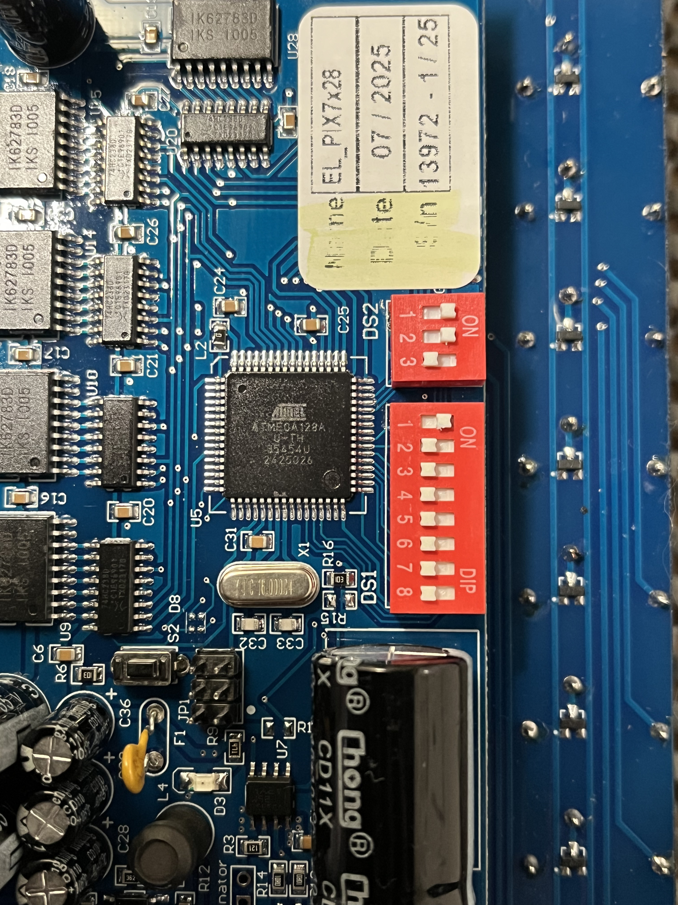

# Flip Dot Display XY5 28x7 raspi python

[日本語版はこちら](README_JP.md)

This project provides Python code to control the Alfa Zeta Flip Dot Display XY5 28x7 using a Raspberry Pi 4B and RASPI HAT. The `frames` directory includes demo frames and the original video file `V.mp4` used to generate these frames. There are three main functionalities included in this directory:

## Table of Contents

- [Demo](#demo)
- [MP4 Conversion](#mp4-conversion)
- [Frame Display](#frame-display)
- [Installation](#installation)
- [Usage](#usage)
- [Control Instructions](CONTROL.md)

## Demo

The `demo.py` script allows you to display specific patterns on the flip-dot display. It uses a matrix like the one below, consisting of 0s and 1s, to create patterns:

```python
matrix = [
    "0000000000000000000000000000",
    "0000000000100000000000000010",
    "1101100000100000000100010000",
    "1010101110101010101110111010",
    "1010101010110010100100010010",
    "1000101110101011100110011010",
    "0000000000000000000000000000"
]
```

## MP4 Conversion

The `MP4.py` script converts video files into black and white, resizes them to 28x7, and converts them into frames using OpenCV. These frames are saved into a directory called `frames`.

## Frame Display

`start.py` スクリプトは `frames` ディレクトリからフレームを読み取り、15フレーム毎秒の速度でフリップドットディスプレイに表示します。このデモンストレーションを [YouTube](https://www.youtube.com/watch?v=qY5p3bfn78A&ab_channel=mokuttii) で見ることができます。


## Installation

To set up the environment for this project, follow these steps:

1. **Enable Serial Port and Disable Serial Console**:
    1. Open the Raspberry Pi configuration tool:
    ```bash
    sudo raspi-config
    ```
    2. Navigate to `Interfacing Options` and select `Serial`.
    3. When asked "Would you like a login shell to be accessible over serial?", select `No`.
    4. When asked "Would you like the serial port hardware to be enabled?", select `Yes`.
    5. Exit the configuration tool and reboot your Raspberry Pi:
    ```bash
    sudo reboot
    ```

2. **Set DIP Switches for Baud Rate and Address**:


    ### DIP Switch Settings

    

    ### Baud Rate (3-Pin DIP)

    The communication transfer speed can be set as follows. Following the settings in the picture, the speed will be 9600.

    ```plaintext
    Value  | DIP Switch Position | Baud Rate
    ---------------------------------------
    0      | ↓ ↓ ↓               | None
    1      | ↑ ↓ ↓               | None
    2      | ↓ ↑ ↓               | None
    3      | ↑ ↑ ↓               | 9600
    4      | ↓ ↓ ↑               | 19200
    5      | ↑ ↓ ↑               | 38400
    6      | ↓ ↑ ↑               | 57600
    7      | ↑ ↑ ↑               | 9600
    Off    |                      |
    ```

    ### Address (8-Pin DIP)

    This address ID is used when pushing image data, and each panel listens to the data.

    ```plaintext
    Pin | Description
    ------------------------------
    0-5 | Address in binary code (natural)
    6   | Magnetization Time: OFF: 500μs (default), ON: 450μs
    7   | Test Mode: ON/OFF. OFF = Normal Operation
    ```

    ### Visual Representation of DIP Switch Settings

    ```plaintext
    3-Pin DIP for Baud Rate:
    -------------------------
      1     2     3
    | ↑ |  ↑ |  ↓ | 9600

    8-Pin DIP for Address:
    -----------------------
      1     2     3     4     5     6     7     8
    | ↑ |  ↓ |  ↓ |  ↓ |  ↓ |  ↓ |  ↓ |  ↓ |
    ```

3. **Create and navigate to the `flip` directory**:
    ```bash
    mkdir flip
    cd flip
    ```

4. **Clone the repository into the `flip` directory**:
    ```bash
    git clone https://github.com/yourusername/yourrepository.git
    cd yourrepository
    ```

5. **Create a virtual environment**:
    ```bash
    python3 -m venv env
    ```

6. **Activate the virtual environment**:
    ```bash
    . /env/bin/activate
    ```

7. **Install the required dependencies**:
    ```bash
    pip install opencv-python pyserial
    ```

These steps will set up your environment to run the scripts provided in this repository.


## Usage

**Note**: Before running any of the scripts, you must activate the virtual environment:
```bash
. /env/bin/activate
```

### Demo

1. **Activate the virtual environment**:
    ```bash
    . /env/bin/activate
    ```

2. **Run the demo script**:
    ```bash
    python3 demo.py
    ```

3. **Run the start.py script**:
    ```bash
    python3 start.py
    ```